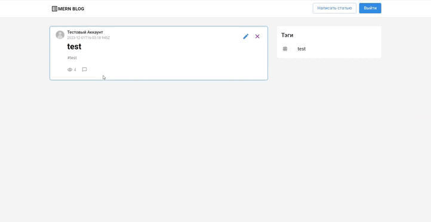

# Project Overview 🚀

This project encompasses a feature-rich application with the following key `functionalities`:

- **Registration**  
Effortlessly sign up for an account on the platform, providing necessary details to create a personalized user profile.

- **Authentication**  
Securely log in using your registered credentials, ensuring a protected and personalized user experience.

- **Post Management**  
Create, edit, and delete posts with ease. Enjoy the flexibility to craft and modify content, tailoring it to your preferences. This feature empowers users to actively contribute and manage their posts within the application.

# Preview 👀

 
### Tech Stack ⚙️

  - ReactJS 
  - Redux Toolkit (Global State Management)
  - React Hook Form (Form Handling)
  - React Markdown / Simple Editor (Article Editor)
  - Axios (HTTP Requests)

### Features

  - Developed using ReactJS
  - State management, article storage, and authentication handled with Redux Toolkit
  - Registration and authentication forms powered by React Hook Form
  - Site navigation implemented with React Router
  - Writing articles facilitated by Markdown and Simple Editor libraries
  - Client-server communication handled by Axios
### Available Scripts 💻

In the project directory, you can run:

#### `npm start`

Runs the app in the development mode.\
Open [http://localhost:3000](http://localhost:3000) to view it in your browser.

The page will reload when you make changes.\
You may also see any lint errors in the console.

#### `npm test`

Launches the test runner in the interactive watch mode.\
See the section about [running tests](https://facebook.github.io/create-react-app/docs/running-tests) for more information.

#### `npm run build`

Builds the app for production to the `build` folder.\
It correctly bundles React in production mode and optimizes the build for the best performance.

The build is minified and the filenames include the hashes.\
Your app is ready to be deployed!

### Access the Project 🌠

[Link to Deployed Website](https://mern-project-frontend-pi.vercel.app/)

For more details on the backend functionality, please refer to the [Backend Repository](https://github.com/antonoptimus/MERN_blog_backend).
